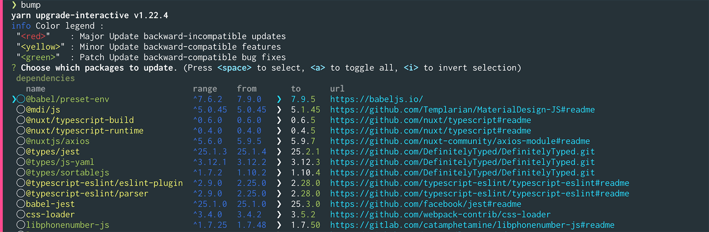

# フロントエンド依存パッケージ更新手順

## 1. 準備
依存パッケージ更新作業の準備として、下記の手順を実行してください。

```bash
# master ブランチの最新バージョンを取得する
git switch master && git pull origin master

# トピックブランチを作成する
git branch misc/DEV-####_xxxx-xxxx-xxxx master

# node_modules を master の最新バージョンに（念入りに）合わせる
rm -rf node_modules && yarn install
```

## 2. 依存パッケージを更新する
コマンド `yarn upgrade-interactive --latest` を実行してください。
下記のようにアップグレード可能なパッケージの一覧が表示されます。



カーソルキーとスペースキーを使ってアップグレードするパッケージを選択後、
Enter キーを押すとパッケージがダウンロードされ `yarn.lock` が更新されます。

この時、アップグレード対象とするパッケージは次のような基準で選択してください。

* すべて選ぶのではなく、1〜3個程度を選ぶようにしてください。
* 関連性の強いパッケージはお互いに依存している場合があるため、
  なるべく一緒にアップグレードした方がトラブルが起きにくい……と思います。

選択したパッケージのインストールが終わったら、この手順を繰り返さずに次の手順に移ってください。

## 3. テストとビルドを実行する
パッケージのアップグレードによって不具合等が発生していないことを確認するため、
テストとビルドを実行してください。

```bash
yarn lint && yarn test:coverage:frontend && yarn frontend:build
```

ここでエラーが発生した場合は次のように対応してください。

1. Vuetify のアップグレードにおいてはスナップショットに細かい差分が生じる場合があります。
   差分の内容を確認し、問題ないようであれば `yarn test:watch` を実行してスナップショットを更新してください。
2. 型定義の変更や、依存パッケージの仕様変更などによるエラーが発生する場合があります。
   がんばって対応してください。
3. がんばってもエラーが解消できそうにない（もしくはとても時間が掛かりそう）な場合は、
   原因となっているパッケージのアップグレードを見送り、Backlog に課題を作成してください。

## 4. 一旦コミットする
```bash
# 1回目のコミットの場合
git commit . -m WIP

# 2回目以降
git commit . -m WIP --amend
```

アップグレード対象のパッケージが残っている場合は手順の 2〜4 を繰り返してください。

## 5. yarn.lock を更新する
`yarn upgrade-interactive` の一通り実行した後、
無駄に同じパッケージのバージョン違いが残ったりする場合があるため `yarn.lock` を更新します。

また、その際に不具合等が発生していないことを確認するためテストも必ず実行してください。

```bash
rm yarn.lock && yarn install && yarn test && yarn build
```

## 6. コミット → プッシュ → プルリクエスト作成
```bash
git commit . --amend -m ":arrow_up: Upgrade frontend dependencies"
git push -u origin
```

プッシュしたらプルリクエストを作成し、レビュー/マージを依頼してください。

おつかれさまでした！
